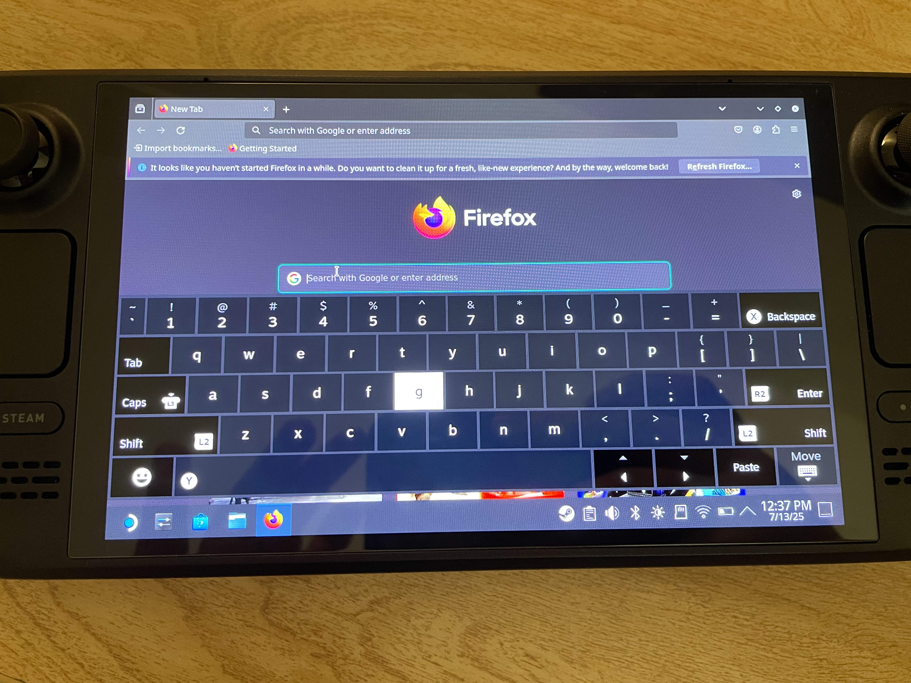
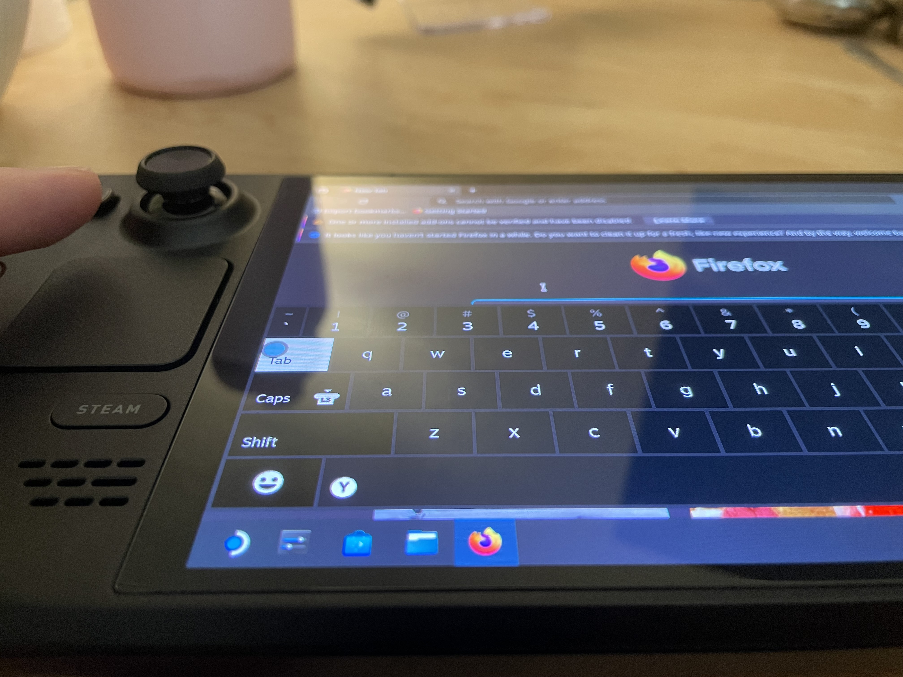

# Why I Wrote This Script
One summer day in 2025, I checked my Steam Deck to make sure all was well after not using it for a few weeks. I turned it on, played for a bit, put it into *sleep* mode, and put it back into its case. A few hours later, I retrieved the Deck, hoping to play more. Upon grabbing the case, I immediately felt immense heat. I swiftly took the Deck out of the case (physically in pain due to how hot it was) and put it into the fridge (yes, I actually did that). Somehow, it has woken itself up from sleep mode, or went into a "false" sleep, and unfortunately, overheated in the case. The Deck is fine for the most part, battery life is normal, no visible issues with the screen, and performance is standard. However, the left touchpad suffered damage. 

# How The Script Fixes My Issue
Theoretically, if the Deck can wake itself up enough to overheat to the point of its almost demise, it should be able to execute this thermal watchdog script. Controlled through systemd, the script will monitor the temperatures of the GPU/CPU socket, battery, WiFi chip, and NVMe SSD. If any of those devices exceed their user-set max temperature, the machine should safely shut down, preventing damage. 

# Touchpad Damage
I'm unsure how the touchpad operates, but I know for sure that the heat damaged it. When in desktop mode with the keyboard open, it will randomly spaz out around the keyboard (not clicking anything, though). When it's stationary, it likes to hang out on the G-key. Also, I have NO idea how, but if I hover my finger half an inch away from the touchpad, it'll trigger it and may go absolutely bonkers. 

### G-Key Resting

### Hovering Over Going Bonkers

# Post Near-Death Life
The Deck is still (mostly) functional, and I can play games with no issue. I had hoped that Steam/Valve would be open to helping me out with my issue, since I feel this issue was not my fault. But their tech support was a dead end. The best-case scenario is if I can get a replacement touchpad from them. I'm more than willing/capable of replacing it myself; I'm just poor. Hopefully, with this script, I won't have any more anxiety about the issue. I literally have not used my Steam Deck since the incident a few months ago. 
